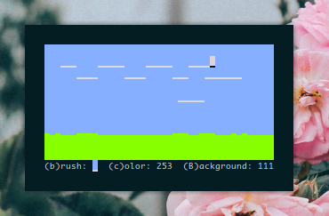

<h3 align="center"></h3>

A pixel art editor for the terminal written in C

<h3 align="center"></h3>

`pxlart` is a pixel art editor written in C using the ncurses library that has vim like keybindings.

## Dependencies
- `ncursesw`

## Installation
- clone the repo

`git clone --depth 1 https://github.com/mananapr/pxlart`

- compile using `make`

`cd pxlart && make`

- install

`sudo make install`

## Keybindings
| Key | Function |
|:---:| --- |
| <kbd>h j k l</kbd> | Navigation keys |
| <kbd>d</kbd> | Draw |
| <kbd>e</kbd> | Erase |
| <kbd>c</kbd> | Set FG Color |
| <kbd>B</kbd> | Set BG Color |
| <kbd>q</kbd> | Quit |

## A note about colors
`pxlart` uses shell color numbers (0-255) for color input. You can use a script like [this](https://gist.github.com/MicahElliott/719710) to see what number corresponds to what color.

## TODO
- [ ] Add ability to save and load
- [ ] Add ability to export to image formats
- [x] Make PKGBUILD for AUR
- [ ] Write a manpage
